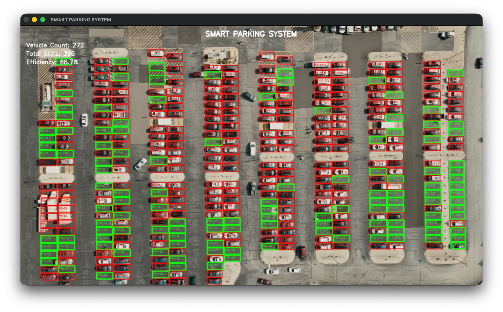
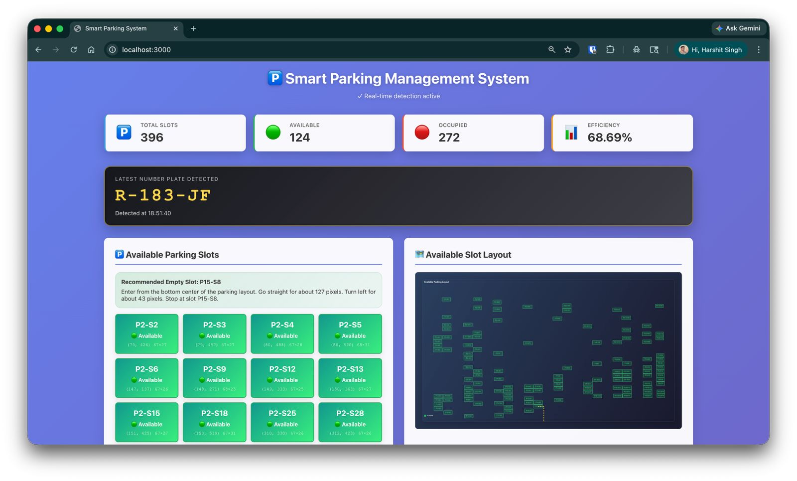
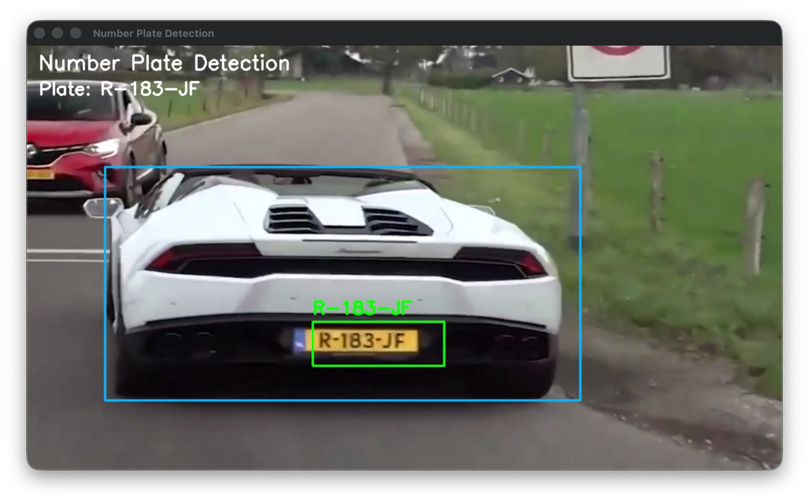
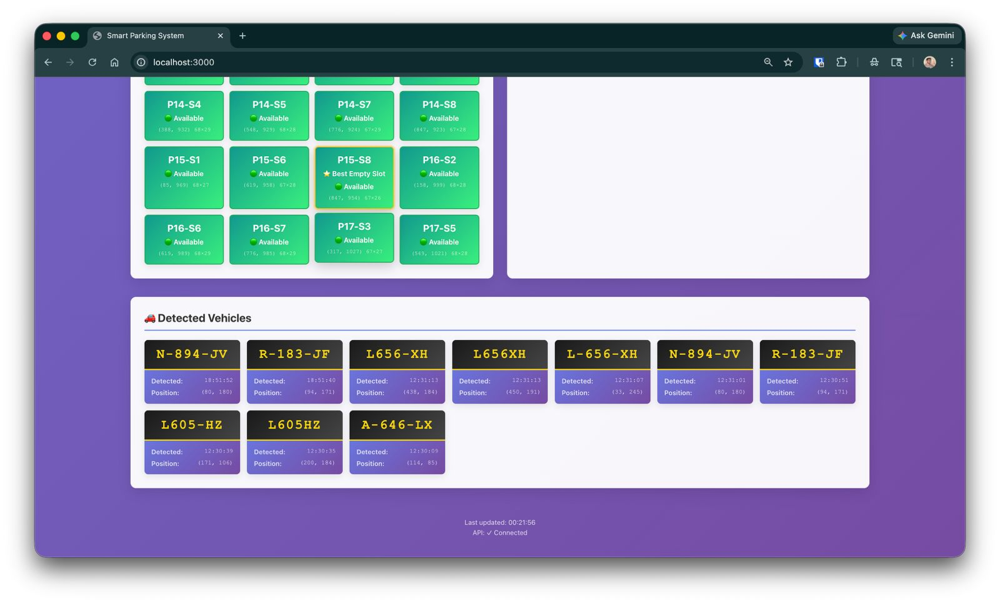

# Smart Parking System

A clean, GitHub-ready machine vision project for parking-slot occupancy detection, vehicle tracking, and license-plate-aware parking guidance.

## Problem Statement

Finding an open parking slot quickly is frustrating in crowded lots, and operators often have limited visibility into slot occupancy and recent vehicle movement. This project demonstrates how computer vision can convert video feeds and layout masks into actionable parking availability data and vehicle records.

## Solution Overview

The repository combines three practical layers:

1. Parking-slot detection using a segmentation mask and a trained occupancy classifier.
2. Vehicle and license-plate ingestion using the existing ANPR workflow.
3. A backend-ready data and recommendation layer that exposes current slot counts, recent vehicles, and the best available slot.

The original parking and ANPR logic has been preserved and wrapped in a cleaner package structure so the code is easier to run, review, and extend.

## Architecture Diagram

```text
parking.mp4 + mask.png
        |
        v
+---------------------------+
| Parking Vision Agent      |
| - detect slots from mask  |
| - classify occupancy      |
+-------------+-------------+
              |
              v
        +-----------+          plate.mp4 / ANPR runtime
        | SQLite DB |<------------------------------+
        +-----+-----+                               |
              |                                     v
              |                           +----------------------+
              |                           | Plate / Vehicle Flow |
              |                           | - plate detection    |
              |                           | - OCR / ingestion    |
              |                           +----------+-----------+
              |                                      |
              v                                      |
    +---------------------+                          |
    | Decision Planner    |--------------------------+
    | - availability      |
    | - nearest slot      |
    | - directions        |
    +----------+----------+
               |
               v
    +----------------------+
    | API + Frontend Layer |
    +----------------------+
```

## Screenshots

### Parking Occupancy Detection



### Dashboard Overview



### Number Plate Detection



### Vehicle Monitoring Panel



## Key Features

- Real-time parking slot occupancy detection from video and mask assets.
- License plate ingestion workflow for recent vehicle history.
- SQLite-backed storage for slots and vehicles.
- Slot recommendation with simple route guidance.
- FastAPI backend routes for dashboard integration.
- Lightweight `python main.py` demo that works without running the full live stack.

## Tech Stack

- Python 3.11+
- OpenCV
- NumPy
- scikit-learn compatible pickled classifier
- YOLO / Ultralytics
- EasyOCR
- FastAPI
- SQLAlchemy
- React frontend dashboard

## Project Workflow

### 1. Classification Layer

The parking pipeline loads `data/masks/mask.png`, extracts slot regions, and classifies each slot as empty or occupied using the existing trained model in `data/models/weights/model.p`.

### 2. Feature Importance (LIME)

This repository does not currently implement LIME. The new structure keeps that future work isolated so an explainability layer can be added later without rewriting the current pipeline.

### 3. Graph Correlation Layer

A full graph-correlation model is not part of the current codebase. The `src/fusion/` package is included as the clean extension point for future research logic.

### 4. Risk Fusion

The current implementation performs lightweight result fusion by combining parking counts, the latest vehicle record, and the recommended slot into one runtime snapshot for demos and APIs.

### 5. LLM Reasoning

There is no LLM reasoning in the current project. The `src/reasoning/` package provides a safe place for human-readable summaries today and can evolve into richer reasoning later.

### 6. Decision Planner

The decision layer selects the best available slot based on location and returns route-style directions from the parking entrance to the recommended slot.

## How It Is Different from Existing Systems

- Combines parking occupancy and vehicle/plate records in one repository.
- Ships with both a live-oriented stack and a lightweight demo entry point.
- Separates core logic, persistence, API, and orchestration for easier maintenance.
- Preserves the original implementation while making extension points explicit for research or viva discussions.

## Installation

```bash
python3 -m venv .venv
source .venv/bin/activate
pip install -r requirements.txt
```

Optional frontend setup:

```bash
cd frontend
npm install
```

## How to Run

### Lightweight demo

```bash
python main.py
```

This path performs a real parking-slot scan on sample data and stores a lightweight demo vehicle record so the repository can be demonstrated quickly on low-resource machines.

### API backend

```bash
python scripts/run_api.py
```

Then open [http://localhost:8000/docs](http://localhost:8000/docs).

### Original interactive parking detector

```bash
python scripts/run_parking_agent.py
```

### Original interactive plate detector

```bash
python scripts/run_plate_agent.py
```

### Frontend dashboard

```bash
cd frontend
npm start
```

## Sample Output Explanation

`python main.py` prints:

- Total detected parking slots
- Number of available vs occupied slots
- Recommended slot label
- Latest stored vehicle plate
- Text directions to the recommended slot

## Folder Structure

```text
project-root/
├── src/
│   ├── agents/        # Parking, plate, orchestration, CLI response helpers
│   ├── api/           # FastAPI application and routes
│   ├── models/        # Database entities and model wrappers
│   ├── fusion/        # Runtime result fusion helpers
│   ├── reasoning/     # Human-readable explanation layer
│   ├── decision/      # Slot recommendation logic
│   └── utils/         # Paths, config, data manager
├── configs/           # Project configuration
├── data/              # Videos, masks, model assets, sample-data notes
├── notebooks/         # Experiment space
├── tests/             # Basic unit tests
├── scripts/           # API and compatibility run scripts
├── frontend/          # React dashboard
├── requirements.txt
├── .gitignore
├── README.md
├── LICENSE
└── main.py
```

## Future Improvements

- Replace the demo stub vehicle with a true one-frame ANPR inference path in `main.py`.
- Add model/config validation and richer logging.
- Move the ANPR notebook into `notebooks/` with a documented experiment report.
- Add CI checks, formatting, and automated tests for API routes.
- Introduce optional explainability and more advanced route scoring.

## Contributors

- Your Name Here
- Contributor 2
